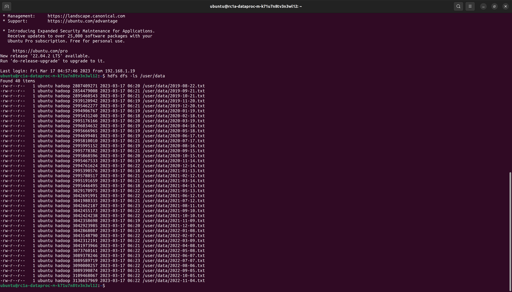
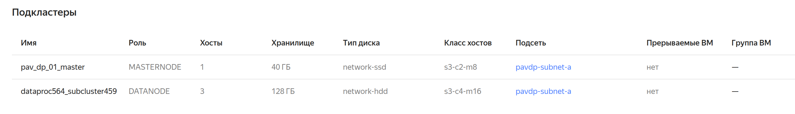

# OTUS MLOps Course HW
## OTUS MLOps HW 01

Описание в файле: ДЗ-1-OpenAI.pdf

## OTUS MLOps HW 02

Хранилище: s3://btest

Состав хранилища Hadoop после выполнения задания 2.2:

Структура кластера:
